# Analysis of Diabetes Health Factors
Aisha Siddiqui 

May 18, 2020

#### Contents

* Acquring Data
* Tidying and Managing Data
* Exploratory Data Analysis
* Hypothesis Testing
* Machine Learning 
* Data Analysis Conclusion

## Introduction
This tutorial of the data science pipeline attempts to determine the predictive significance of different health factors in context of making a diagnosis for diabetes. The correlation between these factors and their relationship to the presence of Diabetes is analyzed. This type of analysis can be useful for further research inquiries into the about the causes and risk factors of Diabetes, as well as for making diagnoses. In this analysis we focus on trying to answer how well the different health factors predict a Diabetes diagnosis.

### Question:
Which health factors are most reliable for predicting whether an individual has diabetes?


```python
# imports
import warnings
warnings.filterwarnings('ignore')
import pandas as pd
import numpy as np
from matplotlib import pyplot as plt
from plotnine import *
import seaborn as sns
import statsmodels.formula.api as sm
import statsmodels.api as smm
from sklearn.linear_model import LogisticRegression
from sklearn import metrics
```

### Acquiring Data

 We are using the Pima Indians Diabetes Database. It was downloaded from https://www.kaggle.com/uciml/pima-indians-diabetes-database. It is a pre-cleaned, standardized dataset that gives us information about different health factors and the existence of Diabetes for a population of adult female patients with Native American heritage. This specific population is useful to study because Native American heritage is a risk factor for developing diabetes according to the CDC website. The dataset contains the following attributes:

#### dataset attributes

* Pregnancies: Number of times patient has been pregnant

* Glucose: Plasma glucose concentration over 2 hours 

* BloodPressure: Diastolic blood pressure (mm Hg)

* SkinThickness: Triceps skin fold thickness (mm)

* Insulin: 2-Hour post-glucose serum insulin level (mu U/ml)

* BMI: Body mass index 

* DiabetesPedigreeFunction: function which scores probability of diabetes based on family history

* Age: Age (years)

* Outcome: 0 if non-diabetic, 1 if diabetic)

First we  load the downloaded the diabetes dataset into a dataframe.


```python
diabetes = pd.read_csv('data/diabetes.csv')
diabetes.head()
```


<div>
<style scoped>
    .dataframe tbody tr th:only-of-type {
        vertical-align: middle;
    }

    .dataframe tbody tr th {
        vertical-align: top;
    }

    .dataframe thead th {
        text-align: right;
    }
</style>
<table border="1" class="dataframe">
  <thead>
    <tr style="text-align: right;">
      <th></th>
      <th>Pregnancies</th>
      <th>Glucose</th>
      <th>BloodPressure</th>
      <th>SkinThickness</th>
      <th>Insulin</th>
      <th>BMI</th>
      <th>DiabetesPedigreeFunction</th>
      <th>Age</th>
      <th>Outcome</th>
    </tr>
  </thead>
  <tbody>
    <tr>
      <td>0</td>
      <td>6</td>
      <td>148</td>
      <td>72</td>
      <td>35</td>
      <td>0</td>
      <td>33.6</td>
      <td>0.627</td>
      <td>50</td>
      <td>1</td>
    </tr>
    <tr>
      <td>1</td>
      <td>1</td>
      <td>85</td>
      <td>66</td>
      <td>29</td>
      <td>0</td>
      <td>26.6</td>
      <td>0.351</td>
      <td>31</td>
      <td>0</td>
    </tr>
    <tr>
      <td>2</td>
      <td>8</td>
      <td>183</td>
      <td>64</td>
      <td>0</td>
      <td>0</td>
      <td>23.3</td>
      <td>0.672</td>
      <td>32</td>
      <td>1</td>
    </tr>
    <tr>
      <td>3</td>
      <td>1</td>
      <td>89</td>
      <td>66</td>
      <td>23</td>
      <td>94</td>
      <td>28.1</td>
      <td>0.167</td>
      <td>21</td>
      <td>0</td>
    </tr>
    <tr>
      <td>4</td>
      <td>0</td>
      <td>137</td>
      <td>40</td>
      <td>35</td>
      <td>168</td>
      <td>43.1</td>
      <td>2.288</td>
      <td>33</td>
      <td>1</td>
    </tr>
  </tbody>
</table>
</div>


### Tidying and Managing Data

Since the data is already in standard form and the column names are adequate for our analysis, we only need to handle missing values. The dataset does not contain NA values but it does have some zeros values for features where they do not make sense. These zeros can be understood to be missing values in this dataset. We need to decide whether to remove entries with missing data or impute data for them. To decide this, we need to know whether the entries with missing data are a large segment of the dataset. We can see that the entries with missing data for the SkinThickness and Insulin attributes make up a large portion of the dataset. As a result, we cannot remove these entries. 


```python
l = diabetes.columns[1:-1].tolist()
df = {}
for x in l:
    s = x + ' == 0'
    df[x] = len(diabetes.query(s)) 

df = pd.DataFrame.from_dict(df, orient='index', columns = ['num_Missing'])
df
```


<div>
<style scoped>
    .dataframe tbody tr th:only-of-type {
        vertical-align: middle;
    }

    .dataframe tbody tr th {
        vertical-align: top;
    }

    .dataframe thead th {
        text-align: right;
    }
</style>
<table border="1" class="dataframe">
  <thead>
    <tr style="text-align: right;">
      <th></th>
      <th>num_Missing</th>
    </tr>
  </thead>
  <tbody>
    <tr>
      <td>Glucose</td>
      <td>5</td>
    </tr>
    <tr>
      <td>BloodPressure</td>
      <td>35</td>
    </tr>
    <tr>
      <td>SkinThickness</td>
      <td>227</td>
    </tr>
    <tr>
      <td>Insulin</td>
      <td>374</td>
    </tr>
    <tr>
      <td>BMI</td>
      <td>11</td>
    </tr>
    <tr>
      <td>DiabetesPedigreeFunction</td>
      <td>0</td>
    </tr>
    <tr>
      <td>Age</td>
      <td>0</td>
    </tr>
  </tbody>
</table>
</div>


Before changing the dataset we need to determine whether any of the attributes are correlated to the absence of any of the attribute values. 


```python
# create a dataframe that encodes the missing status of each attribute in the original dataset as a binary value
missing = diabetes.copy()
missing
m = []
for x in l:
    s = 'missing ' + x
    m.append(s)
    missing[s] = False
    missing[s] = missing[s].where(missing[x] > 0, True)
```

We can visualize the correlation between missing values in each attribute and the other attributes with a heatmap.


```python
# correlation matrix for new dataframe
corr = missing.corr()
# print(corr)
mask = np.zeros_like(corr)
mask[:,9:] = True

# visualize the correlation matrix values with a heatmap 
sns.heatmap(corr, 
            mask = mask,
         xticklabels=corr.columns[:9],
         yticklabels=corr.columns[:-2]
           )

```


    <matplotlib.axes._subplots.AxesSubplot at 0x7f05db160320>


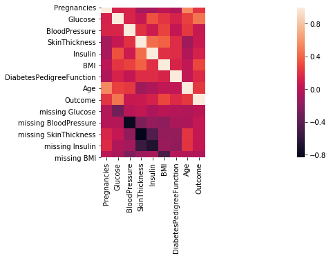


From this we can see that the missing values for all the attributes aside from Skin Thickness and Insulin do not seem to be strongly correlated with any of the other attributes or the outcome. Again we can conclude that we can impute or replace these missing values from these attributes. Since we know that the number of entries with missing values in these attributes is not large, we will remove them. 


```python
diabetes = diabetes.query('Glucose != 0 and BMI !=0 and BloodPressure != 0')
```

Next we need to decide how to deal with missing values in the 'SkinThickness' and 'Insulin' attributes, since we can see from the heatmap that existence of missing values from both of these attributes are correlated with the other attribute itself. We see that the absence of 'Insulin' values determines the absence of 'SkinThickness' values but not vice versa. This indicates that Skin Thickness observations are not made when Insulin level observations are not made. However, we can also see that the Skin Thickness and Insulin attributes are not correlated.Therefore, we can conclude that correlations we see in the heatmap between these two attributes and their missing values are based entirely on the likelihood that one attribute is measured depending on whether the other is. This means we can impute the missing values by simply replacing them with the mean of their respective attribute's total entries. This will retain the central tendency of the attributes, but it will affect their spread and likely impact the analysis. 


```python
sns.swarmplot(x='missing SkinThickness', y ='missing Insulin', data=missing)
sns.lmplot('SkinThickness',y='Insulin', data =missing)
```


    <seaborn.axisgrid.FacetGrid at 0x7f05db03e828>


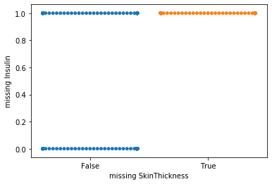


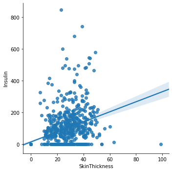


```python
diabetes['SkinThickness'] = diabetes['SkinThickness'].where(diabetes['SkinThickness'] > 0, np.mean(diabetes['SkinThickness']))
diabetes['Insulin'] = diabetes['Insulin'].where(diabetes['Insulin'] > 0, np.mean(diabetes['Insulin']))
```

Lastly, to aid us in during exploratory data analysis phase, we encode the presence of diabetes as a categoricl attribute.


```python
diabetes['Diabetic'] = False
diabetes['Diabetic'] = diabetes['Diabetic'].where(diabetes['Outcome'] == 0, True)
diabetes.head()
```


<div>
<style scoped>
    .dataframe tbody tr th:only-of-type {
        vertical-align: middle;
    }

    .dataframe tbody tr th {
        vertical-align: top;
    }

    .dataframe thead th {
        text-align: right;
    }
</style>
<table border="1" class="dataframe">
  <thead>
    <tr style="text-align: right;">
      <th></th>
      <th>Pregnancies</th>
      <th>Glucose</th>
      <th>BloodPressure</th>
      <th>SkinThickness</th>
      <th>Insulin</th>
      <th>BMI</th>
      <th>DiabetesPedigreeFunction</th>
      <th>Age</th>
      <th>Outcome</th>
      <th>Diabetic</th>
    </tr>
  </thead>
  <tbody>
    <tr>
      <td>0</td>
      <td>6</td>
      <td>148</td>
      <td>72</td>
      <td>35.00000</td>
      <td>84.494475</td>
      <td>33.6</td>
      <td>0.627</td>
      <td>50</td>
      <td>1</td>
      <td>True</td>
    </tr>
    <tr>
      <td>1</td>
      <td>1</td>
      <td>85</td>
      <td>66</td>
      <td>29.00000</td>
      <td>84.494475</td>
      <td>26.6</td>
      <td>0.351</td>
      <td>31</td>
      <td>0</td>
      <td>False</td>
    </tr>
    <tr>
      <td>2</td>
      <td>8</td>
      <td>183</td>
      <td>64</td>
      <td>21.44337</td>
      <td>84.494475</td>
      <td>23.3</td>
      <td>0.672</td>
      <td>32</td>
      <td>1</td>
      <td>True</td>
    </tr>
    <tr>
      <td>3</td>
      <td>1</td>
      <td>89</td>
      <td>66</td>
      <td>23.00000</td>
      <td>94.000000</td>
      <td>28.1</td>
      <td>0.167</td>
      <td>21</td>
      <td>0</td>
      <td>False</td>
    </tr>
    <tr>
      <td>4</td>
      <td>0</td>
      <td>137</td>
      <td>40</td>
      <td>35.00000</td>
      <td>168.000000</td>
      <td>43.1</td>
      <td>2.288</td>
      <td>33</td>
      <td>1</td>
      <td>True</td>
    </tr>
  </tbody>
</table>
</div>


### Exploratory Data Analysis

To get an idea of how different factors affect the outcome of a diabetes diagnosis, we can analyze visualizations of the the data. First we can check how many of the entries have diabetes. We see that there are about twice as many entries for healthy patients than there are for diabetic ones. 


```python
ggplot(diabetes, aes(x='Diabetic')) + geom_bar(aes(fill = 'Diabetic'))
```


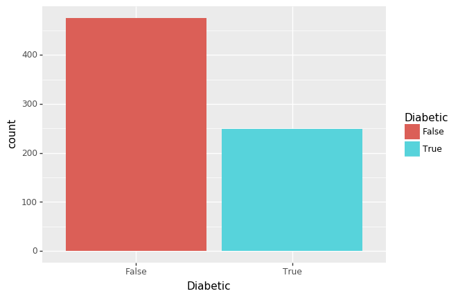


    <ggplot: (8728945376965)>


Next we look at the relationship between all the health factors and the diabetes diagnosis outcome. We visualize this with another heatmap.


```python
corr = diabetes.corr()
# print(corr)
sns.heatmap(corr, 
         xticklabels=corr.columns, 
         yticklabels=corr.columns)
```


    <matplotlib.axes._subplots.AxesSubplot at 0x7f05db25cc88>


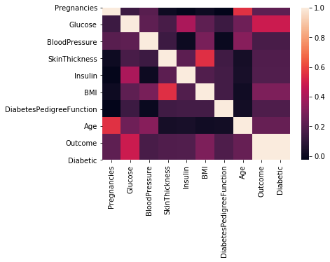


We see that the 'Glucose' attribute is most strongly correlated with being Diabetic. The 'Pregnancies', 'BMI', and 'Age' attributes also appear to be correlated. The correlation between the outcome and these three attributes reflects the risk factors for diabetes defined by the CDC. We can also see the correlation between pairs of attributes such as 'Pregnancies' and 'Age', 'SkinThickness' and 'BMI', and 'SkinThickness' and 'Insulin'. 

Next we plot the distribution of outcomes for each of the different health factors with histograms.


```python
ggplot(diabetes, aes(x='Pregnancies', fill = 'Diabetic'))  + geom_histogram( color = 'black')  + ggtitle("Pregnancies vs. Diabetic")
```


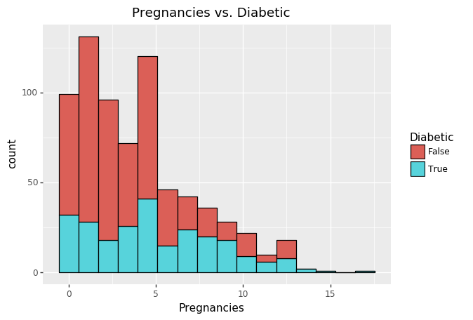


    <ggplot: (8728946289654)>


The distribution of diabetic outcomes across the pregnancies attribute is further skewed towards a higher number of pregnancies than the distribution for non-diabetic outcomes. This indicates that the number of pregnancies is likely positively related to a diabetic diagnosis.


```python
ggplot(diabetes, aes(x='Glucose', fill = 'Diabetic'))  + geom_histogram( color = 'black')  + ggtitle("Glucose vs. Diabetic")
```


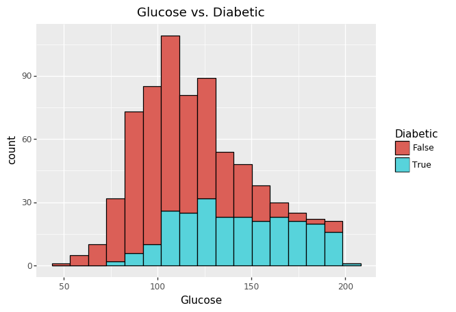


    <ggplot: (-9223363307908499021)>


The distribution of diabetic outcomes across the glucose attribute is further skewed towards a higher number of pregnancies than the distribution for non-diabetic outcomes. The central tendency for diabetic entries is at also at higher glucose values than non-diabetic entries. This indicates that the number of pregnancies is likely positively related to a diabetic diagnosis.


```python
ggplot(diabetes, aes(x='BloodPressure', fill = 'Diabetic'))  + geom_histogram( color = 'black')  + ggtitle("Blood Pressure vs. Diabetic")
```


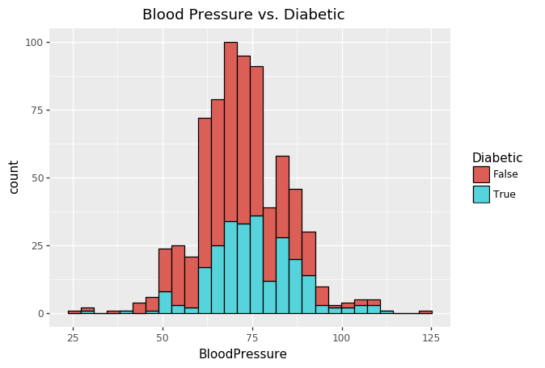


    <ggplot: (-9223363307908464380)>


The distribution across blood pressure values is similar for diabetic and non-diabetic entries. This further indicates that blood pressure has little predictive significance for a diabetes diagnosis.


```python
ggplot(diabetes, aes(x='SkinThickness', fill = 'Diabetic'))  + geom_histogram( color = 'black')  + ggtitle("SkinThickness vs. Diabetic")
```


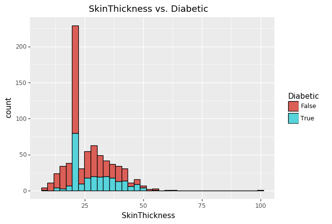


    <ggplot: (8728959149488)>


The distribution across skin thickness values is similar for diabetic and non-diabetic entries. This further indicates that skin thickness has little predictive significance for a diabetes diagnosis. We see that there is a large concentration of values at a specific interval. This is likely due to the normalization of a large number of missing values. 


```python
ggplot(diabetes, aes(x='Insulin', fill = 'Diabetic'))  + geom_histogram( color = 'black')  + ggtitle("Insulin vs. Diabetic")
```


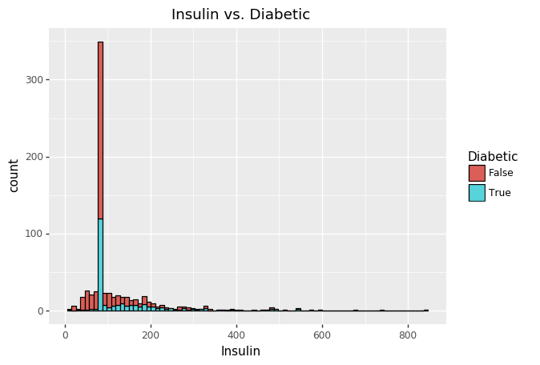


    <ggplot: (8728945924065)>


The distribution across insulin values for diabetic outcomes is skewed towards higher insulin values the distribution for non-diabetic outcomes. This indicates that the insulin factor is likely positively related to a diabetic diagnosis. We see that there is a large concentration of values at a specific interval. This is likely due to the normalization of a large number of missing values. 


```python
ggplot(diabetes, aes(x='BMI', fill = 'Diabetic'))  + geom_histogram( color = 'black')  + ggtitle("BMI vs. Diabetic")
```


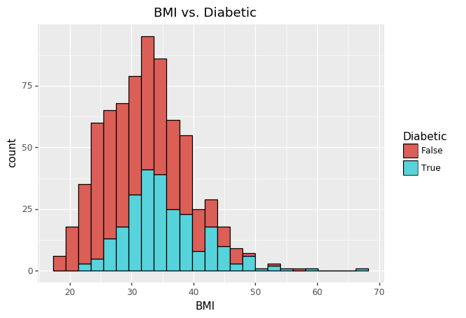


    <ggplot: (-9223363307908958597)>


The distribution across BMI values of diabetic outcomes a skewed towards higher BMIs than the distribution for non-diabetic outcomes. There are fewer diabetic entries at lower BMIs than higher BMIs. This indicates that the number of pregnancies is likely positively related to a diabetic diagnosis.


```python
ggplot(diabetes, aes(x='DiabetesPedigreeFunction', fill = 'Diabetic')) + geom_histogram( color = 'black')  + ggtitle("Diabetes Pedigree Function  vs. Diabetic")
```


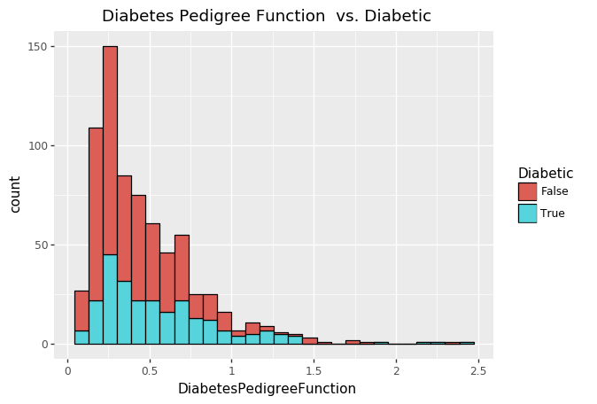


    <ggplot: (8728946380976)>


The distribution across values of the diabetes pedigree function is similar for diabetic and non-diabetic entries. This further indicates that the pedigree function has little predictive significance for a diabetes diagnosis.


```python
ggplot(diabetes, aes(x='Age', fill = 'Diabetic'))  + geom_histogram( color = 'black')  + ggtitle("Age vs. Diabetic")
```


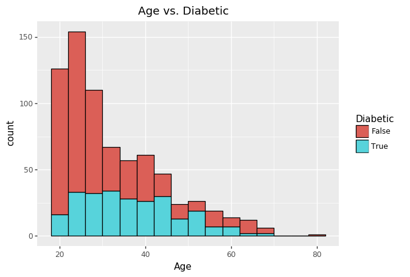


    <ggplot: (-9223363307908371470)>


The distribution across age values is somewhat more uniform for diabetic entries than it is for non-diabetic entries, which are more concentrated at lower ages. This may indicate that age is positively correlated with a diabetes diagnosis.

### Hypothesis Testing 

Now that we have an idea of how each factor effects the outcome diagnosis, we can test these insights with hypothesis testing. The null hypothesis we are trying to reject is that none of the health factors affect the probability of the outcome. We perform a logistic regression to test the this hypothesis. 


```python
# drop the 'Diabetic' attribute to return the dataframe to make the regression easier
diabetes = diabetes.drop(['Diabetic'], axis=1)

```


```python
logit = smm.Logit(diabetes['Outcome'], diabetes.drop(['Outcome'],axis=1))
result = logit.fit(method='bfgs')

```

    Optimization terminated successfully.
             Current function value: 0.578055
             Iterations: 21
             Function evaluations: 25
             Gradient evaluations: 25


```python
result.summary()
```


<table class="simpletable">
<caption>Logit Regression Results</caption>
<tr>
  <th>Dep. Variable:</th>        <td>Outcome</td>     <th>  No. Observations:  </th>  <td>   724</td>  
</tr>
<tr>
  <th>Model:</th>                 <td>Logit</td>      <th>  Df Residuals:      </th>  <td>   716</td>  
</tr>
<tr>
  <th>Method:</th>                 <td>MLE</td>       <th>  Df Model:          </th>  <td>     7</td>  
</tr>
<tr>
  <th>Date:</th>            <td>Mon, 18 May 2020</td> <th>  Pseudo R-squ.:     </th>  <td>0.1018</td>  
</tr>
<tr>
  <th>Time:</th>                <td>19:37:00</td>     <th>  Log-Likelihood:    </th> <td> -418.51</td> 
</tr>
<tr>
  <th>converged:</th>             <td>True</td>       <th>  LL-Null:           </th> <td> -465.97</td> 
</tr>
<tr>
  <th>Covariance Type:</th>     <td>nonrobust</td>    <th>  LLR p-value:       </th> <td>1.208e-17</td>
</tr>
</table>
<table class="simpletable">
<tr>
              <td></td>                <th>coef</th>     <th>std err</th>      <th>z</th>      <th>P>|z|</th>  <th>[0.025</th>    <th>0.975]</th>  
</tr>
<tr>
  <th>Pregnancies</th>              <td>    0.1310</td> <td>    0.030</td> <td>    4.296</td> <td> 0.000</td> <td>    0.071</td> <td>    0.191</td>
</tr>
<tr>
  <th>Glucose</th>                  <td>    0.0214</td> <td>    0.003</td> <td>    6.613</td> <td> 0.000</td> <td>    0.015</td> <td>    0.028</td>
</tr>
<tr>
  <th>BloodPressure</th>            <td>   -0.0572</td> <td>    0.007</td> <td>   -7.983</td> <td> 0.000</td> <td>   -0.071</td> <td>   -0.043</td>
</tr>
<tr>
  <th>SkinThickness</th>            <td>   -0.0045</td> <td>    0.011</td> <td>   -0.425</td> <td> 0.671</td> <td>   -0.025</td> <td>    0.016</td>
</tr>
<tr>
  <th>Insulin</th>                  <td>   -0.0002</td> <td>    0.001</td> <td>   -0.160</td> <td> 0.873</td> <td>   -0.002</td> <td>    0.002</td>
</tr>
<tr>
  <th>BMI</th>                      <td>    0.0126</td> <td>    0.015</td> <td>    0.841</td> <td> 0.401</td> <td>   -0.017</td> <td>    0.042</td>
</tr>
<tr>
  <th>DiabetesPedigreeFunction</th> <td>    0.4568</td> <td>    0.257</td> <td>    1.775</td> <td> 0.076</td> <td>   -0.048</td> <td>    0.961</td>
</tr>
<tr>
  <th>Age</th>                      <td>   -0.0020</td> <td>    0.009</td> <td>   -0.217</td> <td> 0.828</td> <td>   -0.020</td> <td>    0.016</td>
</tr>
</table>


The regression shows that P values for the 'Pregnancies' , 'Glucose', and 'Blood Pressure' are small enough (less than .01) to reject the null hypotheis. This indicates that these factors are statistically significant in predicting the probability of a diabetes diagnosis. The other factors have P values higher than the threshold of 0.1 and so we cannot assume that they will affect the outcome. The coefficients of 'Pregnancies' and 'Glucose' are positive, this means that they likely have a positive relationship with a diabetes diagnosis.'BloodPressure', with a negative coefficient, likely has a negative relationship with the outcome.

### Machine Learning 

Next we can train a machine learning model to learn a classifier predicts how the health factors impact a diabetes diagnosis. Here we use a logistic regression classifer.

First we split the dataset into training data which the classifier is fit on. Then we use the remaining data to evaluate the accuracy of the classifer. The classifier will use the health factor attributes as features and the the diabetes outcome attribute as a label. The training and test data each have these components. 


```python
dfTrain = diabetes[:650]
dfTest = diabetes[650:]
```


```python
# remove cat var
trainLabel = np.asarray(dfTrain['Outcome'])
trainData = np.asarray(dfTrain.drop(['Outcome'],axis=1))
testLabel = np.asarray(dfTest['Outcome'])
testData = np.asarray(dfTest.drop(['Outcome'],axis=1))
```

Then we normalize and standardize the features so they are centered around a mean and have a similar spread. This makes the machine learning model more effective and accurate.


```python
means = np.mean(trainData, axis=0)
stds = np.std(trainData, axis=0)

trainData = (trainData - means)/stds
testData = (testData - means)/stds
```

After the logistic regression model is trained on the training data, we can check its accuracy on the test data. We see that the classifer achieves an 81% accuracy in predicting the diabetes outcome of the test data based on the health factors.


```python
diabetesCF = LogisticRegression()
diabetesCF.fit(trainData,trainLabel)
accuracy = diabetesCF.score(testData,testLabel)
print("accuracy = ",accuracy * 100,"%")
```

    accuracy =  81.08108108108108 %


Now we can see how the classifer used each of the health factors to predict the outcome. The coefficients used by the logistic regression model indicate the importance of each of the health factors in the prediction. We can plot the importance of each of the health factors as follows:


```python
coeff = list(diabetesCF.coef_[0])
labels = list(diabetes.columns[:-1])
features = pd.DataFrame()
features['features'] = labels
features['importance'] = coeff
features['positive'] = features['importance'] > 0
```


```python
ggplot(features,aes(x='features',y='importance', fill='positive')) + geom_bar(stat='identity') + coord_flip()
```


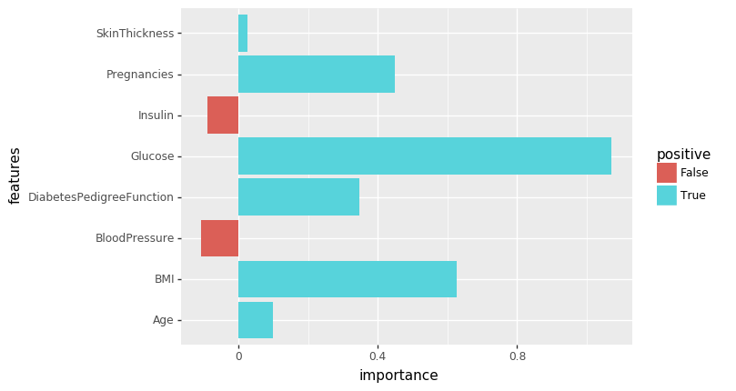


    <ggplot: (-9223363307908371666)>


The logistic regression model seemed to weigh the 'Glucose' attribute the highest, followed by the 'BMI' and 'Pregnancies' attributes. These had a positive relationship with the diabetes outcome. The 'BloodPressure' attribute had a negative relationship with the diabetes outcome. 'Age', 'Insulin', and 'SkinThickness' had a very small effect on the model's predictions. The 'Diabetes Pedigree Function had a relatively large impact on the prediction in comparison. This contradicts with the hypothesis testing and visual data analysis which pointed to the function having little impact on the diabetes diagnosis outcome. 

###  Analysis and Conclusion

Each phase of analysis gave us insights into how well each of the health factors predict a diabetes diagnosis. The exploratory data analysis allowed us to visualize how each of the health factors were correlated to the outcome of the diagnosis. From this phase we saw a strong correlation between 'Pregnancies', 'Glucose' and a diabetes diagnosis. We also so see that 'Age', 'BMI', and 'Insulin' seem to have some impact, judging from similar visualizations. The hypothesis testing with logistic regressio confirms the significance of 'Pregnancies' and 'Glucose' in predicting diabetes outcomes. It also indicated that blood pressure was statistically significant for this prediction. The other attributes were not statistically significant according to the hypotheisis testing. During machine learning, the model of logistic regression further confirmed that 'Glucose' and 'Pregnancies' are the most important health factors in determining a diabetes diagnosis. However, we also see that compared to the hypotheisis testing, the model overutilizes 'BMI' and underutilizes 'BloodPressure'. 

Ultimately, Glucose levels and number of pregnancies seem to be the most reliable health factors for predicting a diabetes diagnosis outcome. BMI and BloodPressure and the value of the DiabetesPedigree Function might also be useful to varying degrees. 

Although pregnancy is a risk factor for gestational diabetes according to the CDC report on diabetes, our analysis does not show a great deal of support for the other risk factors defined by the CDC, such as age, frequency of diabetes amongst family members, and being overweight. Our analysis only shows a small amount of support for these factors. 

Nevertheless, our analysis gives us a better understanding of how different health factors can be used to diagnose diabetes. The different phases of analysis in this data science pipeline gave us more information about how each of the attributes is correlated with diabetes.
